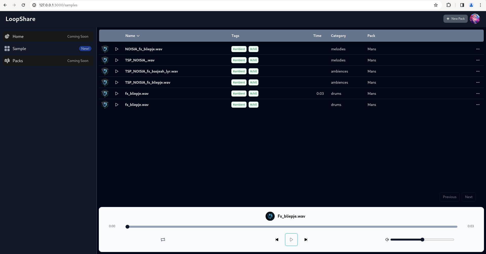

# OpenLoop

## A Docker containerized web application (A la Splice) to store and organize a music production library

This Project is made as a necessity for me and my friends, we love to share samples, stems and loops and we've always struggled with organizing our libraries,
so this is a attempt to solve both of the problems by making a nice Splice inspired UI to allow us to upload/download, listen and manage samples.

### The main goal of this project is to allow us to share and access our library whenever we are, without worring about carrying HDD's or to have to fiddle with remote storages every single time, plus the benefit of having a UI to submit the sample packs and getting them organized clearly in folders

This is developed to be a self-hosted solution so the main setup would be behind a cloudflare zero-trust network, and given access to a restrict number of people, is not intended to be public in any means,
therefore security isn't the main concern, but i'll try my best to keep the code secure.

#### Some Pro's of this approach are:
- we will not be bounded by memory as the server could easily have multiple HDD to store the data in a centralized position, plus the cost of the internal HDD is less that the portable ones
- we could have automatic centralized backups or RAID configuration to avoid loss of data, plus it's easier to backup evrything
- we could have access to the website everywhere, having access to all samples from all pc's we'd like, without worrying about the aforementioned problems in the Goal of the project.
- much easier interface to manage the library, plus search and tagging capabilities which are impossible in a standard library folder (Windows users would understand the search problems)

#### Some Cons of this approach are:
- we have to run the server somewhere, hopefully making the whole project a docker image will simplify this
- we will have to download the samples before being able to use them, a client application like Splice did can definitely help, API are used in the backend so this is possible

## Tech Stack:
- Django + rest-framework
- PostgreSQL
- Gunicorn
- Nginx
- Nextjs
- Tailwindcss

## Current Feature Status:
### BACKEND
- Multiple File/Folder upload on Admin site
- 3 Main Packs Types: Prod. kit, Sample kit, drum kit
- 5 Main Samples Categories: Drums, Vocals, Melodies, Fx, Ambients
- Tags support for single Sample and Pack (Pack tags get inherited by all Samples in a Pack for now)
- Automatic Sample duration calcolation
- API to retrieve sample list
### FRONTEND
-  Multipage Sample List view with filtering and ordering
-  Download Sample button
-  Audio Player with loop functionality
-  Copy Sample URL button

## Planned Features:
- Implement API for saving data (now is only used to fetch)
- Implement waveform generation and visualization on webUI
- Implement User management and creation (as of now is thought to be single user w/o auth)
- Implement cart functionality for multiple downloads
- Implement personal favourites library

### HOWTO
as this is still in development, this is just a simple explanation of how this is supposed to work for now:
- with portainer deploy a stack using this repo as source, you should add env variables from portainer stack env vars
- run a shell inside web container and create a superuser using manage.py
- Open the admin site and add a new pack
- the new pack page in the admin has some custom fields to allow uploading multiple folders/files for every single field
- every field corresponds to one category of Samples (eg. melody, drums, ecc)
- Fill the required fields and save
- Now you should be able to view and browse samples from the frontend

